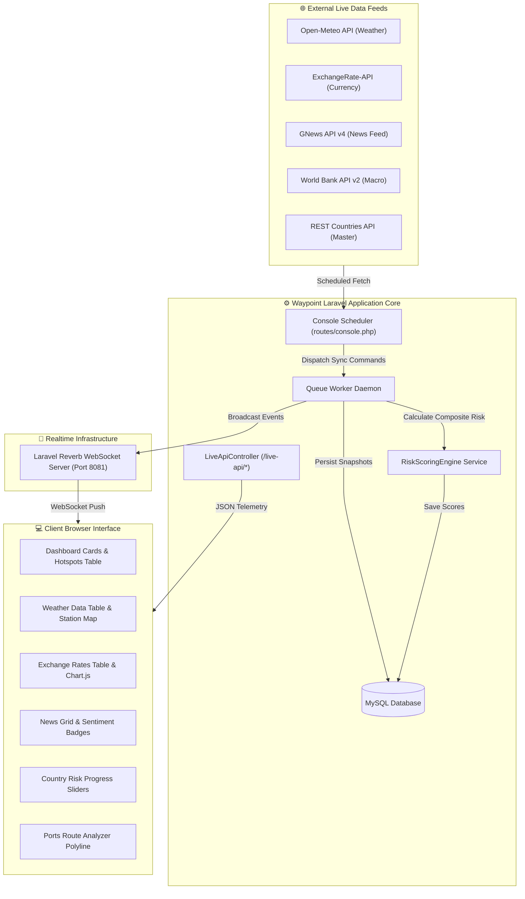

<div align="center">

  <br />
  
  <br />

  # Waypoint
  ### Global Supply Chain Intelligence Platform

  *A web platform for monitoring macroeconomic, geopolitical, weather, and maritime logistics risk feeds.*

  <br />

  [](https://laravel.com)
  [](https://php.net)
  [](https://mysql.com)
  [](https://getbootstrap.com)
  [](https://developer.mozilla.org)
  [](https://leafletjs.com)
  [](https://chartjs.org)
  [](https://reverb.laravel.com)
  [](https://railway.app)
  [](LICENSE)

  <br />

  [🌐 **Live Demo**](#-live-demo) • [✨ **Key Features**](#-key-features) • [🚀 **Installation**](#-quick-start) • [📖 **API Docs**](#-rest-api)

</div>

---

## ⚡ Project Highlights

| Highlight | Details |
| :--- | :--- |
| 🌍 **195 Countries Monitored** | Full sovereign demographic and macroeconomic profiles |
| ⚓ **9,494 Seaports Tracked** | International UN/LOCODE maritime infrastructure registry |
| 💱 **139 Currency Pairs** | Daily market rate volatility monitoring benchmarked against USD & IDR |
| 🌦 **Live Weather Network** | Open-Meteo station telemetry with heatwave & storm alert flags |
| 📰 **Global News Feed** | GNews API integration with automated sentiment analysis |
| ⚖ **Dynamic Risk Engine** | Weighted category scoring algorithm based on live external feeds |
| 📡 **Laravel Reverb WebSockets** | Event-driven data push mechanism to active client browsers |
| 🚄 **Railway Containerized Deployment** | Dual-daemon background worker execution on cloud infrastructure |
| 🔌 **JSON REST API** | Structured endpoints for multi-country data access |
| 🗺 **Interactive Map Layers** | Leaflet.js rendering for geospatial weather and maritime routes |

---

## 📌 Table of Contents

- [Overview](#-overview)
- [Live Demo](#-live-demo)
- [Key Features](#-key-features)
- [Screenshots](#-screenshots)
- [Technology Stack](#-technology-stack)
- [System Architecture](#-system-architecture)
- [Quick Start](#-quick-start)
- [Environment Variables](#-environment-variables)
- [Local Execution](#-local-execution)
- [Production Deployment](#-production-deployment)
- [Realtime System](#-realtime-system)
- [External APIs](#-external-apis)
- [REST API](#-rest-api)
- [Project Structure](#-project-structure)
- [Performance & Security](#-performance--security)
- [License](#-license)

---

## 📖 Overview

**Waypoint** is a web application designed to collect, process, score, and visualize global supply chain risk indicators across **195 sovereign countries** and **9,494 international seaports**.

The platform ingests live feeds from public data sources (REST Countries, World Bank, Open-Meteo, ExchangeRate-API, and GNews API), computes weighted composite risk scores across five risk domains (Economic, Geopolitical, Weather, Currency, and Logistics), and broadcasts updates to web browsers via **Laravel Reverb WebSockets**.

> [!NOTE]
> All core data points are synchronized periodically via background scheduler commands and stored locally in MySQL for fast retrieval.

---

## 🌐 Live Demo

The application is deployed on Railway and available publicly:

- **Production URL**: [https://global-supply-production.up.railway.app](https://global-supply-production.up.railway.app)
- **Demo User Account**:
  - **Email**: `user@waypoint.com`
  - **Password**: `password`
- **Demo Admin Account**:
  - **Email**: `admin@waypoint.com`
  - **Password**: `password`

---

## ✨ Key Features

| Feature Component | Description | Status |
| :--- | :--- | :---: |
| **Executive Dashboard** | Overview cards, top risk hotspots, risk radar, and interactive Leaflet map | ✅ Active |
| **Countries Hub** | Demographic profiles, macroeconomic data, and risk category sliders | ✅ Active |
| **Weather Monitor** | 195 weather stations tracking ambient temperature, humidity, wind, and alerts | ✅ Active |
| **Currency Monitor** | 139 exchange rates, top gainers/losers lists, and Chart.js volatility chart | ✅ Active |
| **Geopolitical News** | Global news feed with sentiment classification (Positive, Neutral, Negative) | ✅ Active |
| **Smart Route Analyzer** | Maritime route planner with distance (NM/km), transit duration, and clean polyline | ✅ Active |
| **Comparison Console** | Multi-country side-by-side risk and demographic comparison | ✅ Active |
| **User Watchlist** | Custom pinned watchlists with user-defined threshold alerts | ✅ Active |
| **Admin Controls** | Category risk weight editor, manual API sync triggers, and user manager | ✅ Active |
| **Realtime WebSockets** | Reverb event broadcasting updating active browser views on data ingestion | ✅ Active |
| **REST API** | JSON endpoints returning country, risk, port, weather, and exchange data | ✅ Active |

---

## 🖼 Screenshots

> [!TIP]
> Add screenshot assets to `public/images/screenshots/` to display visual previews below.

### Executive Dashboard

*Executive dashboard containing summary metrics, top risk hotspots, and global Leaflet map.*

### Weather Monitoring Station Network

*Station weather monitor with heatwave and storm alert markers.*

### Currency Impact & Exchange Rates

*Exchange rate table, top market movers, and Chart.js volatility trend graph.*

### Smart Maritime Shipping Route Analyzer

*Maritime shipping analyzer displaying origin and destination markers with calculated transit parameters.*

---

## 🛠 Technology Stack

| Domain | Technologies |
| :--- | :--- |
| **Backend Framework** | Laravel 11.x |
| **Runtime Language** | PHP 8.2+ |
| **Database** | MySQL 8.0+ |
| **Realtime Engine** | Laravel Reverb WebSockets |
| **Frontend Layout** | Blade Templates + Bootstrap 5.3 |
| **Interactive Maps** | Leaflet.js 1.9.4 |
| **Data Charts** | Chart.js 4.x |
| **Asset Bundler** | Vite 5.x |
| **Cloud Hosting** | Railway Cloud Application Platform |

---

## 🏛 System Architecture



---

## 🚀 Quick Start

### Prerequisites
- **PHP**: `>= 8.2` (`pdo_mysql`, `curl`, `mbstring`, `xml`, `zip`)
- **Composer**: `>= 2.5`
- **Node.js**: `>= 18.0`
- **MySQL**: `>= 8.0`

### Step-by-Step Installation

```bash
# 1. Clone the repository
git clone https://github.com/RifqiAqil-ops/global-supply.git
cd global-supply

# 2. Install PHP and Node dependencies
composer install
npm install

# 3. Environment configuration
cp .env.example .env
php artisan key:generate

# 4. Configure database in .env and run migrations with seeders
php artisan migrate --seed

# 5. Execute initial data synchronization commands
php artisan gscrip:sync-countries
php artisan gscrip:sync-worldbank
php artisan gscrip:sync-weather
php artisan gscrip:sync-exchange
php artisan gscrip:sync-news
php artisan gscrip:recalculate-risk

# 6. Build frontend production assets
npm run build
```

---

## 🔑 Environment Variables

Here are the primary required `.env` variables:

```env
APP_NAME=Waypoint
APP_ENV=local
APP_KEY=base64:your_generated_app_key
APP_URL=http://localhost:8000

DB_CONNECTION=mysql
DB_HOST=127.0.0.1
DB_PORT=3306
DB_DATABASE=global_supply
DB_USERNAME=root
DB_PASSWORD=your_mysql_password

CACHE_STORE=database
QUEUE_CONNECTION=database
BROADCAST_CONNECTION=reverb

REVERB_APP_ID=808100
REVERB_APP_KEY=your_reverb_app_key
REVERB_APP_SECRET=your_reverb_app_secret
REVERB_HOST=127.0.0.1
REVERB_PORT=8081
REVERB_SCHEME=http

VITE_REVERB_APP_KEY="${REVERB_APP_KEY}"
VITE_REVERB_HOST="${REVERB_HOST}"
VITE_REVERB_PORT="${REVERB_PORT}"
VITE_REVERB_SCHEME="${REVERB_SCHEME}"

GNEWS_API_KEY=your_optional_gnews_api_key
```

---

## 💻 Local Execution

To run the full stack locally with WebSocket broadcasting:

```bash
# Terminal 1: Application Web Server
php artisan serve --port=8000

# Terminal 2: Laravel Reverb WebSocket Daemon
php artisan reverb:start --port=8081

# Terminal 3: Background Queue Worker
php artisan queue:work

# Terminal 4: Vite Development HMR (Optional)
npm run dev
```

Visit the application at `http://localhost:8000`.

---

## 🚄 Production Deployment

Waypoint uses a shell startup script (`railway-start.sh`) for containerized execution on Railway:

```bash
#!/bin/bash
set -e

# 1. Symlink storage
php artisan storage:link || true

# 2. Run pending database migrations
php artisan migrate --force

# 3. Optimize application caches
php artisan optimize:clear
php artisan cache:clear
php artisan config:cache
php artisan route:cache
php artisan view:cache

# 4. Start WebSocket daemon in background
php artisan reverb:start --host=0.0.0.0 --port=8081 &

# 5. Start Queue worker in background
php artisan queue:work --tries=3 --timeout=90 &

# 6. Start main HTTP Web Server
php artisan serve --host 0.0.0.0 --port $PORT
```

---

## 📡 Realtime System Architecture

Waypoint uses **Laravel Reverb** to push data updates to browser clients.

### Broadcast Event Registry

| Event Class | Channel Name | Trigger Condition |
| :--- | :--- | :--- |
| `WeatherUpdated` | `weather-channel`, `system-sync` | Open-Meteo synchronization completed |
| `ExchangeRateUpdated` | `currency-channel`, `system-sync` | ExchangeRate-API synchronization completed |
| `NewsUpdated` | `news-channel`, `system-sync` | GNews API synchronization completed |
| `RiskScoreUpdated` | `risk-channel`, `system-sync` | Composite risk score recalculation finished |
| `CountryUpdated` | `country-channel`, `system-sync` | Master country demographic update |
| `DataSyncCompleted` | `system-sync` | Manual or scheduled data sync finished |
| `RiskWeightsUpdated` | `risk-weights` | Admin updated category risk weight sliders |
| `WatchlistUpdated` | `private-user.{id}` | Watchlist entry updated or alert triggered |

---

## 🌐 External Data Sources

1. **REST Countries API**: Sovereign country master profiles, capitals, coordinates, and flags.
2. **World Bank API v2**: Macroeconomic GDP (Current USD) and inflation rate indicators.
3. **Open-Meteo API**: Batch weather forecasts (temperature, humidity, wind, UV, precipitation).
4. **ExchangeRate API**: Real-time currency exchange rates for 139 currencies.
5. **GNews API v4**: Global logistics and trade news feed articles.

---

## 🔌 REST API Endpoints

Structured JSON endpoints for programmatic integration:

```http
GET /api/countries
GET /api/risk
GET /api/ports
GET /api/news
GET /api/currency
GET /live-api/dashboard-metrics
GET /live-api/weather
GET /live-api/exchange-rates
GET /live-api/news
GET /live-api/country-risk/{code}
```

---

## 📂 Project Structure

```text
global-supply/
├── app/
│   ├── Console/Commands/       # Scheduled Sync Artisan Commands
│   ├── Events/                 # Laravel Reverb Broadcast Events
│   ├── Http/Controllers/       # Live API, User, and Admin Controllers
│   ├── Models/                 # Eloquent Data Models
│   └── Services/External/      # External API Service Classes
├── database/
│   ├── migrations/             # Database Schema Migrations
│   └── seeders/                # Initial Data Seeders
├── public/                     # Public Web Root & Built Assets
├── resources/
│   ├── js/                     # Client Scripts & Echo Setup
│   └── views/                  # Blade Templates & Layouts
├── routes/
│   ├── api.php                 # REST API Routes
│   ├── channels.php            # Broadcasting Channels
│   ├── console.php            # Console Task Scheduler
│   └── web.php                 # Web UI Routes
└── railway-start.sh            # Production Container Startup Script
```

---

## 🛡 Performance & Security

- **Caching**: Master datasets are cached locally (`database` cache driver) and invalidated upon synchronization completion.
- **Eager Loading**: Eloquent queries use explicit eager loading (`with(['riskCategory', 'country'])`) to avoid N+1 query overhead.
- **Access Control**: Role-based access control (`admin` middleware) restricts administrative sync controls and scoring weight adjustments.
- **Sanitization**: CSRF tokens (`@csrf`) on forms and input validation on all controller requests.

---

## 📄 License

This project is open-source software licensed under the [MIT License](LICENSE).

---

<div align="center">
  <sub>Maintained by <a href="https://github.com/RifqiAqil-ops">@RifqiAqil-ops</a> • Built with Laravel 11 & Bootstrap 5</sub>
</div>
