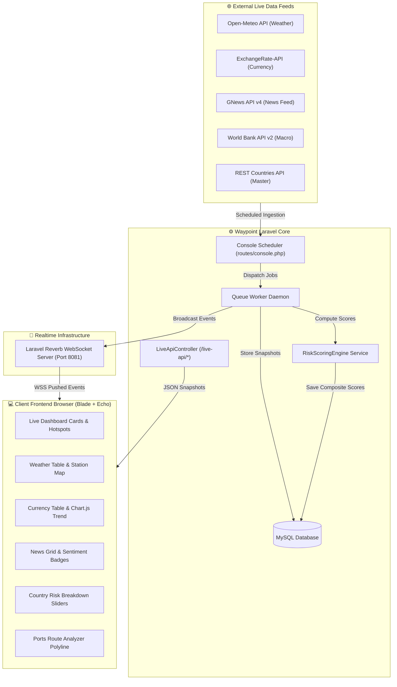

<div align="center">

  <br />
  
  <br />

  # 🌐 WAYPOINT
  ### Global Supply Chain Intelligence Platform

  *Real-Time Macroeconomic, Geopolitical, Weather, & Maritime Logistics Risk Engine*

  <br />

  [](https://laravel.com)
  [](https://php.net)
  [](https://mysql.com)
  [](https://getbootstrap.com)
  [](https://developer.mozilla.org)
  [](https://leafletjs.com)
  [](https://chartjs.org)
  [](https://reverb.laravel.com)
  [](https://railway.app)
  [](LICENSE)
  [](https://github.com/RifqiAqil-ops/global-supply)

  <br />

  [🌐 **Live Production App**](https://global-supply-production.up.railway.app) • [📖 **API Documentation**](#-rest-api) • [🚀 **Getting Started**](#-installation)

</div>

---

## 📋 Executive Overview

**Waypoint** is an enterprise-grade **Global Supply Chain Intelligence Platform** designed to monitor, score, and visualize macroeconomic, geopolitical, weather, currency, and maritime transport risks across **195 sovereign countries** and **9,494 international seaports** in real time.

Built on **Laravel 11**, **MySQL**, **Laravel Reverb WebSockets**, **Leaflet.js**, and **Chart.js**, Waypoint automatically synchronizes live feeds from multiple external APIs (REST Countries, World Bank, Open-Meteo, ExchangeRate-API, and GNews API), computes weighted multi-factor risk scores, and streams updates directly to connected web clients with **zero page refresh**.

---

## ✨ Key Implemented Features

### 📊 Live Executive Dashboard
- **Summary Key Performance Indicators**: Real-time trackers for Global Average Risk Index, Total Countries Monitored (195), Active Extreme Weather Alerts, and Currencies Monitored (139).
- **Top Risk Hotspots & Leaderboards**: Dynamic rankings for Top 10 Highest Risk Countries, Top 10 Lowest Risk Countries, Recent Score Shifters, and Active System Alerts.
- **Interactive Risk World Map**: Leaflet.js global map with color-coded country risk markers and interactive popup telemetry.
- **Risk Scope Radar & Regional Distribution**: Chart.js visualizations breakdown risk across 5 primary categories (Economic, Weather, Currency, Geopolitical, Logistics) and 5 world regions (Americas, Asia, Europe, Africa, Oceania).

### 🌍 Sovereign Countries Intelligence Hub
- **Complete 195 Country Directory**: Full demographic, economic, and logistical profiles for every UN-recognized sovereign state.
- **Single-Country Deep Dive**: Visual telemetry detailing ISO2/ISO3 codes, capitals, population headcount, GDP, currencies, languages, regions, subregions, and live weather conditions.
- **Composite Risk Score Breakdown**: Interactive weighted breakdown featuring weighted sliders and category progress bars.

### 🌤️ Global Weather Monitoring & Extreme Front Alerts
- **195 Station Weather Network**: Live tracking of ambient temperature (°C), apparent temperature, humidity (%), wind speed (km/h), precipitation (mm), UV index, and weather descriptions.
- **Extreme Heat & Storm Front Detection**: Automated flag system identifying dangerous weather anomalies (temp > 35°C, high wind, dense rain, or thunderstorms).
- **Interactive Station Map**: Leaflet map layer displaying live station markers and weather alerts globally.

### 💸 Currency Exchange Volatility Monitor
- **139 Currency Pairs Tracked**: Live rates formatted against USD and IDR with 4-decimal precision and dynamic inverse display.
- **Market Movers Ranking**: Real-time Top Gainers and Top Losers tables based on percentage change.
- **14-Day Volatility Trend Chart**: Dynamic multi-dataset Chart.js line graph updating live without instance destruction.

### 📰 Geopolitical News Feed & Sentiment Analysis
- **Global News Intelligence**: Real-time aggregation of international trade, economic, and logistics news via GNews API.
- **Automated Sentiment Classification**: News articles tagged with `Positive`, `Neutral`, or `Negative` sentiment indicators.
- **Topic & Country Tagging**: Categorized by Geopolitics, Logistics, and Economics.

### ⚓ Ports Directory & Smart Maritime Route Analyzer
- **9,494 Seaports Registry**: Comprehensive global maritime port database searchable by UN/LOCODE, port name, country, and port type.
- **Smart Maritime Shipping Route Analyzer**:
  - Calculates marine distance in Nautical Miles (NM) and Kilometers (km).
  - Estimates vessel transit duration (ETA in days at average cruising speed of 18 knots).
  - Determines composite route risk level (`Safest`, `Fastest`, `Balanced`) using origin and destination country risk scores.
  - **Clean Visualization**: Polyline connection with distinct Red Origin (●) and Green Destination (●) Leaflet markers.

### ⚖️ Multi-Country Risk Comparison Console
- Side-by-side comparative analysis between any 2 or 3 sovereign countries.
- Direct parameter comparison across population, GDP, composite risk index, weather severity, and currency volatility.

### ⭐ User Watchlist & Alert System
- Custom user watchlists allowing users to pin high-risk countries and assign custom risk alert thresholds.
- Instant WebSocket notification dispatch when a pinned country's composite score exceeds user threshold.

### 🛡️ Admin Management Console & API Sync Controls
- **Scoring Weight Adjuster**: Interactive weights console allowing administrators to adjust Category Risk Weights (must total 100%), automatically triggering system-wide risk recalculation.
- **Data Synchronization Dashboard**: Manual override interface to force-sync individual or all external APIs (REST Countries, World Bank, Weather, Exchange Rates, News).
- **External API Diagnostics**: Integrated latency and HTTP status code checker (200, 401, 429, 504) for external API endpoints.
- **User Manager**: Complete User CRUD console for administrative account management.

---

## 🛠️ Technology Stack

| Layer | Technology / Library | Purpose |
| :--- | :--- | :--- |
| **Backend Framework** | Laravel 11.x | Enterprise PHP Application Architecture |
| **Language** | PHP 8.2+ | Server-Side Execution |
| **Database** | MySQL 8.0+ | Relational Data Storage & Indexing |
| **Realtime Engine** | Laravel Reverb | High-Performance WebSocket Daemon |
| **Frontend UI** | Blade & Bootstrap 5.3 | Responsive Modern Component Layouts |
| **Interactive Maps** | Leaflet.js 1.9.4 | Canvas & SVG Geospatial Visualization |
| **Data Analytics** | Chart.js 4.x | Line, Bar, and Radar Chart Rendering |
| **Asset Pipeline** | Vite 5.x / Laravel Vite | ESM Asset Bundling & Minification |
| **Deployment** | Railway App Cloud | Cloud Containerization & Daemon Process Execution |

---

## 🏛️ System Architecture



---

## 📷 Screenshots & Visual Tour

> [!NOTE]
> *Insert actual application screenshots into the specified locations below.*

### 1. Executive Realtime Dashboard

*Figure 1: Executive Dashboard showing global risk index, top risk hotspots leaderboard, risk radar chart, and live Leaflet risk map.*

### 2. Global Weather Monitoring Console

*Figure 2: Live Weather Station network with extreme weather badges and weather station map overlay.*

### 3. Currency Impact & Volatility Tracker

*Figure 3: Currency exchange rate tracking console with top gainers/losers and Chart.js trend dataset.*

### 4. Smart Maritime Ports Route Analyzer

*Figure 4: Smart Maritime Route Analyzer connecting origin and destination ports with distance and ETA calculation.*

---

## ⚡ Installation Guide

### Prerequisites
Ensure your local environment meets the following software requirements:
- **PHP**: `^8.2` (Extensions required: `pdo_mysql`, `curl`, `mbstring`, `openssl`, `xml`, `zip`)
- **Composer**: `^2.5`
- **Node.js**: `^18.0` or `^20.0`
- **npm**: `^9.0`
- **MySQL**: `^8.0` or MariaDB `^10.5`

### Step-by-Step Installation

1. **Clone the Repository**:
   ```bash
   git clone https://github.com/RifqiAqil-ops/global-supply.git
   cd global-supply
   ```

2. **Install PHP Dependencies**:
   ```bash
   composer install
   ```

3. **Install Frontend Dependencies**:
   ```bash
   npm install
   ```

4. **Set Up Environment File**:
   ```bash
   cp .env.example .env
   ```

5. **Generate Application Key**:
   ```bash
   php artisan key:generate
   ```

6. **Configure Database Settings**:
   Open `.env` and configure your database credentials:
   ```env
   DB_CONNECTION=mysql
   DB_HOST=127.0.0.1
   DB_PORT=3306
   DB_DATABASE=global_supply
   DB_USERNAME=root
   DB_PASSWORD=your_password
   ```

7. **Run Migrations & Seeders**:
   ```bash
   php artisan migrate --seed
   ```

8. **Synchronize Master Data & Calculate Initial Scores**:
   ```bash
   php artisan gscrip:sync-countries
   php artisan gscrip:sync-worldbank
   php artisan gscrip:sync-weather
   php artisan gscrip:sync-exchange
   php artisan gscrip:sync-news
   php artisan gscrip:recalculate-risk
   ```

9. **Build Frontend Assets**:
   ```bash
   npm run build
   ```

---

## 🔑 Environment Variables Reference

| Variable | Description | Default / Example Value |
| :--- | :--- | :--- |
| `APP_NAME` | Application Brand Title | `Waypoint` |
| `APP_ENV` | Application Environment | `local` / `production` |
| `APP_KEY` | Encrypted Application Key | `base64:...` |
| `APP_URL` | Base Application URL | `https://global-supply-production.up.railway.app` |
| `DB_CONNECTION` | Primary Database Driver | `mysql` |
| `CACHE_STORE` | Cache Repository Storage | `database` / `redis` |
| `QUEUE_CONNECTION` | Job Queue Connection Driver | `database` |
| `BROADCAST_CONNECTION` | Broadcast Channel Driver | `reverb` |
| `REVERB_APP_ID` | Laravel Reverb Application ID | `808100` |
| `REVERB_APP_KEY` | Laravel Reverb Public Key | `waypoint-reverb-key` |
| `REVERB_APP_SECRET` | Laravel Reverb Secret Key | `waypoint-reverb-secret` |
| `REVERB_HOST` | Laravel Reverb Host Name | `0.0.0.0` |
| `REVERB_PORT` | Laravel Reverb Listening Port | `8081` |
| `REVERB_SCHEME` | Laravel Reverb Protocol | `http` / `https` |
| `VITE_REVERB_APP_KEY` | Client-side Vite Reverb Key | `${REVERB_APP_KEY}` |
| `VITE_REVERB_HOST` | Client-side Vite Reverb Host | `${REVERB_HOST}` |
| `VITE_REVERB_PORT` | Client-side Vite Reverb Port | `${REVERB_PORT}` |
| `VITE_REVERB_SCHEME` | Client-side Vite Reverb Scheme| `http` / `https` |
| `GNEWS_API_KEY` | Optional GNews API Key | `7344b28905b738f6...` |

---

## 💻 Running Locally

To run the complete platform locally with WebSocket broadcasting enabled:

1. **Start the Laravel Development Server**:
   ```bash
   php artisan serve --port=8000
   ```

2. **Start the Laravel Reverb WebSocket Daemon**:
   ```bash
   php artisan reverb:start --port=8081
   ```

3. **Start the Background Queue Worker**:
   ```bash
   php artisan queue:work
   ```

4. **Start Vite Asset HMR (Optional for development)**:
   ```bash
   npm run dev
   ```

5. Access the application in your browser at `http://localhost:8000`.

---

## ☁️ Railway Production Deployment

Waypoint is optimized for zero-downtime containerized deployment on **Railway.app**.

### Production Startup Script (`railway-start.sh`)
The container startup script automatically handles database migrations, asset caching, daemon processes, and web server startup:

```bash
#!/bin/bash
set -e

echo "🚀 Starting Waypoint Production Container Deployment..."

# 1. Symlink storage
php artisan storage:link || true

# 2. Database migrations
php artisan migrate --force

# 3. Optimize application caches
php artisan optimize:clear
php artisan cache:clear
php artisan config:cache
php artisan route:cache
php artisan view:cache

# 4. Start Laravel Reverb WebSocket daemon in background
echo "📡 Launching Laravel Reverb WebSocket Daemon on port 8081..."
php artisan reverb:start --host=0.0.0.0 --port=8081 &

# 5. Start Queue Worker in background
echo "⚙️ Launching Queue Worker Daemon..."
php artisan queue:work --tries=3 --timeout=90 &

# 6. Start Web Server
echo "🌐 Starting HTTP Web Server..."
php artisan serve --host 0.0.0.0 --port $PORT
```

---

## 📡 Realtime Infrastructure (Laravel Reverb)

Waypoint features a 100% Real-Time Architecture powered by **Laravel Reverb**, **Laravel Echo**, and **HTML5 WebSockets**.

### Event & Channel Registry

| Event Class | Broadcast Channel | Payload Summary |
| :--- | :--- | :--- |
| `App\Events\WeatherUpdated` | `weather-channel`, `system-sync` | Processed station count & weather alerts |
| `App\Events\ExchangeRateUpdated` | `currency-channel`, `system-sync` | Total currencies & top gainers/losers |
| `App\Events\NewsUpdated` | `news-channel`, `system-sync` | New articles count & sentiment summary |
| `App\Events\RiskScoreUpdated` | `risk-channel`, `system-sync` | Composite risk scores & leaderboard rankings |
| `App\Events\CountryUpdated` | `country-channel`, `system-sync` | Master country demographic changes |
| `App\Events\DataSyncCompleted` | `system-sync` | Service sync status & timing metrics |
| `App\Events\RiskWeightsUpdated` | `risk-weights` | Admin category weight percentages |
| `App\Events\WatchlistUpdated` | `private-user.{id}` | Watchlist alerts & country thresholds |

---

## 🌐 External APIs Integration

Waypoint integrates feeds from **5 external public APIs**:

1. **REST Countries API** (`https://raw.githubusercontent.com/mledoze/countries/master/countries.json`)
   - Provides master country data, ISO codes, capitals, flags, borders, languages, and geographic coordinates.
2. **World Bank API v2** (`https://api.worldbank.org/v2`)
   - Fetches macroeconomic indicators including GDP (Current USD) and inflation rates.
3. **Open-Meteo API** (`https://api.open-meteo.com/v1`)
   - Provides batch weather forecasts (temperature, apparent temp, humidity, wind speed, precipitation, UV index).
4. **ExchangeRate API** (`https://api.exchangerate-api.com/v4`)
   - Provides real-time exchange rates for 139 currencies benchmarked against USD.
5. **GNews API v4** (`https://gnews.io/api/v4`)
   - Fetches international supply chain, trade, and economic news articles.

---

## 🔌 REST API Reference

Waypoint exposes public REST API endpoints returning structured JSON responses:

```http
GET /api/countries
GET /api/risk
GET /api/ports
GET /api/news
GET /api/currency
GET /live-api/dashboard-metrics
GET /live-api/weather
GET /live-api/exchange-rates
GET /live-api/news
GET /live-api/country-risk/{code}
```

### Sample Response (`GET /live-api/dashboard-metrics`):
```json
{
  "status": "success",
  "data": {
    "avgRisk": "34.74",
    "countriesMonitored": 195,
    "extremeWeatherCount": 17,
    "currenciesCount": 139,
    "topRiskCountries": [
      {
        "iso2": "CD",
        "country_name": "DR Congo",
        "country_flag": "https://flagcdn.com/w320/cd.png",
        "composite_score": 50.81,
        "risk_level": "medium",
        "score_change": 13.89
      }
    ]
  }
}
```

---

## 📂 Project Structure

```text
global-supply/
├── app/
│   ├── Console/
│   │   └── Commands/
│   │       ├── RecalculateRiskCommand.php
│   │       ├── SyncCountriesCommand.php
│   │       ├── SyncExchangeCommand.php
│   │       ├── SyncNewsCommand.php
│   │       ├── SyncWeatherCommand.php
│   │       └── SyncWorldBankCommand.php
│   ├── Events/
│   │   ├── CountryUpdated.php
│   │   ├── ExchangeRateUpdated.php
│   │   ├── NewsUpdated.php
│   │   ├── RiskScoreUpdated.php
│   │   └── WeatherUpdated.php
│   ├── Http/
│   │   ├── Controllers/
│   │   │   ├── Admin/
│   │   │   ├── User/
│   │   │   └── LiveApiController.php
│   │   └── Middleware/
│   ├── Models/
│   │   ├── Country.php
│   │   ├── CountryRiskScore.php
│   │   ├── ExchangeRate.php
│   │   ├── NewsArticle.php
│   │   ├── Port.php
│   │   ├── RiskCategory.php
│   │   ├── RiskWeight.php
│   │   └── WeatherData.php
│   └── Services/
│       ├── Contracts/
│       └── External/
│           ├── ExchangeRateService.php
│           ├── GNewsService.php
│           ├── OpenMeteoService.php
│           ├── RestCountriesService.php
│           └── WorldBankService.php
├── database/
│   ├── migrations/
│   └── seeders/
├── public/
│   ├── build/
│   └── images/
├── resources/
│   ├── js/
│   │   ├── app.js
│   │   └── bootstrap.js
│   └── views/
│       ├── admin/
│       ├── components/
│       ├── user/
│       └── layouts/
│           └── app.blade.php
├── routes/
│   ├── api.php
│   ├── channels.php
│   ├── console.php
│   └── web.php
├── railway-start.sh
└── vite.config.js
```

---

## ⚡ Performance & Caching Strategy

- **Database Cache Store**: Frequently requested datasets are cached in the database cache store to eliminate redundant external HTTP overhead.
- **Cache Invalidation on Sync**: Automated cache flushing (`Cache::forget(...)`) executes immediately after background jobs complete synchronization.
- **Eager Loading**: All Eloquent queries utilize explicit eager loading (`with(['riskCategory', 'country'])`) to prevent N+1 query performance bottlenecks.
- **Chunked Processing**: Batch processing (e.g. 50 locations per Open-Meteo weather batch request) minimizes memory usage during scheduled executions.

---

## 🔒 Security & Access Control

- **Role-Based Access Control (RBAC)**: Enforced via `admin` middleware restricting sensitive synchronization controls and weight adjustments to administrator roles.
- **CSRF & XSS Protection**: All forms utilize `@csrf` Blade directives, and client-side rendering uses HTML-escaped string interpolation.
- **Input Validation**: Request validation rules sanitizing port IDs, country codes, search parameters, and scoring weight sums.

---

## 🗺️ Realistic Future Roadmap

- [ ] **AI-Powered Predictive Risk Modeling**: Machine learning algorithms forecasting risk shifts based on historic trends.
- [ ] **Multi-Modal Route Optimization**: Expanding port route analyzer to include rail, air freight, and inland trucking routes.
- [ ] **Custom Webhook Subscriptions**: Allowing third-party ERP systems to register webhook endpoints for real-time risk alerts.

---

## 📄 License

Distributed under the **MIT License**. See [`LICENSE`](LICENSE) for complete license details.

---

## 👤 Author & Maintainer

**Waypoint Engineering Team**  
*Global Supply Chain Risk Intelligence Platform*  

- **GitHub**: [@RifqiAqil-ops](https://github.com/RifqiAqil-ops)  
- **Live Demo**: [global-supply-production.up.railway.app](https://global-supply-production.up.railway.app)  

<div align="center">
  <sub>Built with ❤️ using Laravel 11, Reverb WebSockets, and Bootstrap 5.</sub>
</div>
